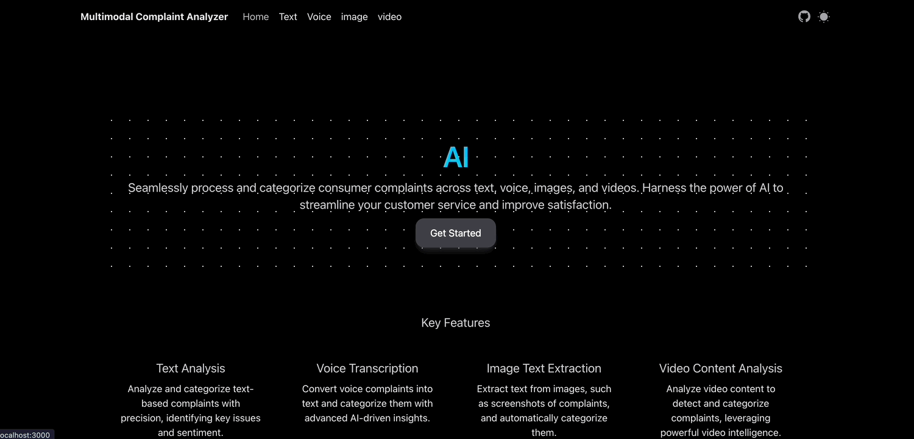

## Technologies Used

- [Next.js 14](https://nextjs.org/docs/getting-started)
- [NextUI](https://nextui.org)
- [Tailwind CSS](https://tailwindcss.com)
- [Tailwind Variants](https://tailwind-variants.org)
- [TypeScript](https://www.typescriptlang.org)
- [Framer Motion](https://www.framer.com/motion)
- [next-themes](https://github.com/pacocoursey/next-themes)
- [Google-Cloud-Platform](https://console.cloud.google.com/)

## How to Use

clone this repo create a dot env file with your gcp credentails and run your application locally.

GOOGLE_CLOUD_API_KEY=your-GCP-API-KEY
GOOGLE_CLOUD_PROJECT_ID=your-GCP-PROJECT-ID

### Install dependencies

You can use one of them `npm`, `yarn`, `pnpm`, `bun`, Example using `npm`:

```bash
npm install
```

### Run the development server

```bash
npm run dev
```

## License

Licensed under the [MIT license](https://github.com/nextui-org/next-pages-template/blob/main/LICENSE).
